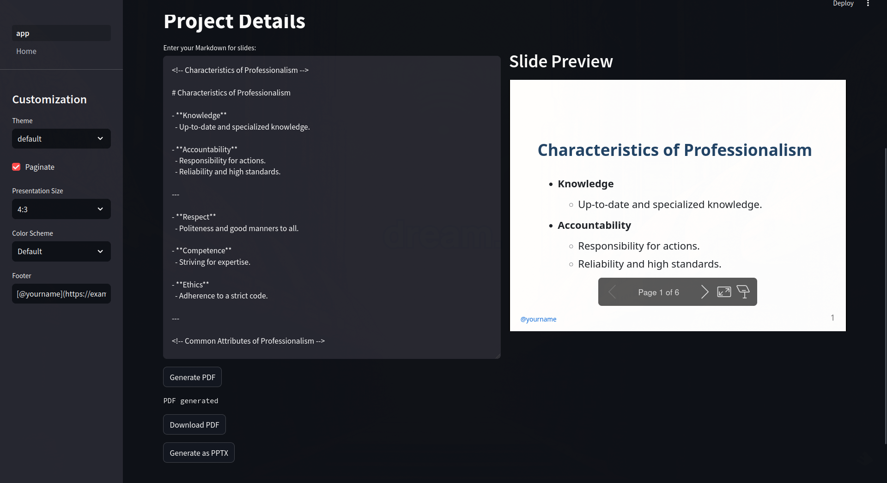
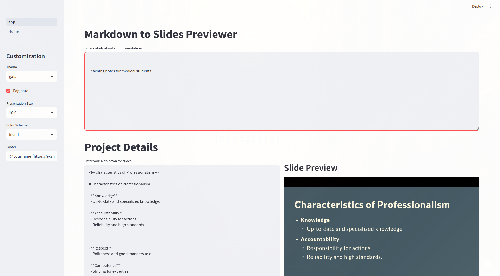

# Ezy-Slide-generator

This Streamlit web application allows you to generate Marp Markdown slides for presentations with customizable themes and attributes. You can preview the slides in real-time and download them as HTML, PDF, or PPTX.

### Features:

- **Customization Sidebar:** Modify theme, title, keywords, pagination, size, and footer for your slides.
- **Markdown Input:** Enter your presentation content using Markdown syntax.
- **Real-time Preview:** See the generated slides instantly in the preview pane.
- **Download Options:** Export slides as PDF or PPTX files directly from the app.
- **Docker Support:** Easily deploy the app using Docker or Docker Compose.
- **Theming** - Built in auto applyable 3 styles that can be swapped with single click
- **Color Scheme support** Supports both dark and light color schemes for slides generated

### How to Use:

1. **Clone the Repository:**

   ```bash
   git clone https://github.com/aldrinjenson/ezy-slides
   cd streamlit-marp-slide-generator
   ```

2. **Install Dependencies:**
   Make sure you have Python and Streamlit installed.

   ```bash
   pip install streamlit
   ```

3. **Run the Application Locally:**

   ```bash
   streamlit run app.py
   ```

   The app will open in your default web browser.

4. **Using Docker for Deployment:**
   If you prefer Docker for deployment, follow these steps:

   - **Build the Docker Image:**

     ```bash
     docker build -t streamlit-marp-slide-generator .
     ```

   - **Run the Docker Container:**

     ```bash
     docker run -p 8501:8501 streamlit-marp-slide-generator
     ```

   - **Access the App:**
     Open your web browser and go to `http://localhost:8501` to access the application running inside the Docker container.

5. **Using Docker Compose (Optional):**
   If you prefer using Docker Compose for managing your application and its dependencies, use the provided `docker-compose.yml` file.

   - **Build and Run with Docker Compose:**

     ```bash
     docker-compose up -d --build
     ```

   - **Access the App:**
     Open your web browser and go to `http://localhost:8501` to access the application managed by Docker Compose.

### Screenshots:





### About:

This project is developed using Streamlit and Marp CLI to simplify the process of creating professional presentations from Markdown. It is suitable for educators, professionals, and anyone needing a quick and efficient way to generate and customize slides.

### License:

This project is licensed under the MIT License - see the [LICENSE](LICENSE) file for details.
